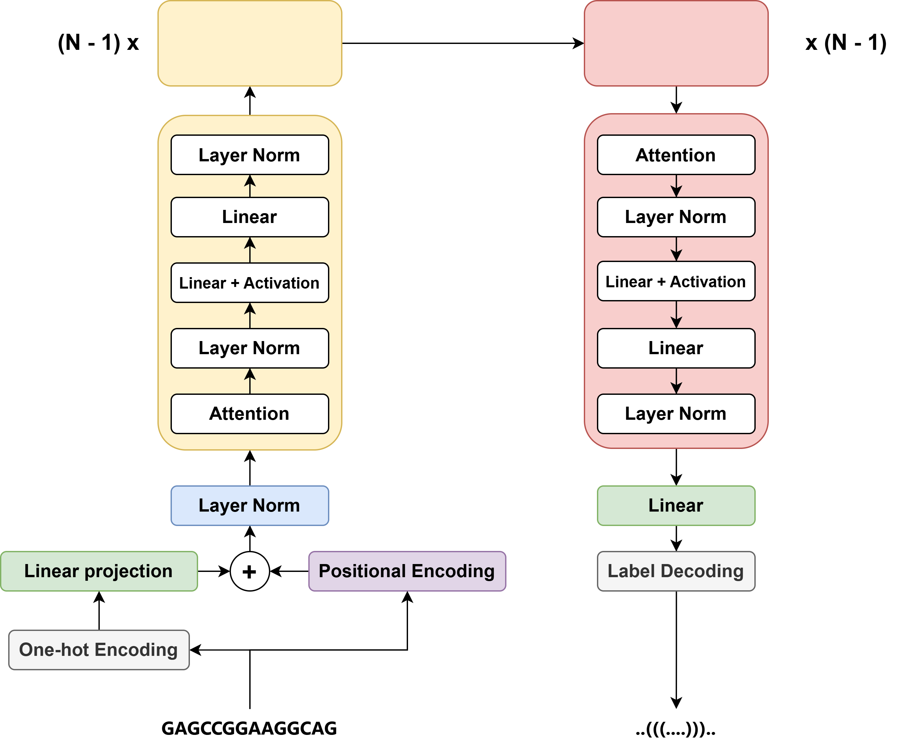

# 🧬 Eternal: RNA Secondary Structure Prediction

[](https://opensource.org/licenses/MIT)
[](https://www.python.org/downloads/)
[](https://pytorch.org/)

## 🌟 Overview

**EteRNAity** is a revolutionary transformer-based approach for RNA secondary structure prediction that treats the problem as a sequence-to-sequence translation task. Using a streamlined encoder-decoder architecture with chunked linear attention, our model achieves competitive results compared to state-of-the-art methods while using significantly fewer parameters (~55K).

<p align="center">
  
</p>

## ✨ Key Features

- **Lightweight Architecture**: Achieves competitive accuracy with only ~55K parameters
- **Innovative Objective Function**: Explicitly accounts for base-pair relationships
- **Cross-Family Generalization**: Effective across various RNA families
- **Chunked Linear Attention**: Efficiently handles longer RNA sequences
- **Simple & Effective**: Intuitive encoder-decoder design with minimal complexity

## 📊 Performance

EteRNAity demonstrates impressive performance across different RNA families:

| RNA Family | EteRNAity (ReLU) | MXfold2 (Current SOTA) | UFold |
|------------|------------------|---------|-------|
| 5S rRNA    | 0.50             | 0.54    | 0.53  |
| SRP        | 0.49             | 0.50    | 0.26  |
| tRNA       | 0.72             | 0.64    | 0.26  |
| tmRNA      | 0.48             | 0.46    | 0.40  |
| RNaseP     | 0.46             | 0.51    | 0.41  |
| Overall    | 0.52             | 0.51    | 0.44  |

## 🧪 How It Works

EteRNAity translates RNA sequences (A, C, G, U) into dot-bracket notation representing secondary structure:

```
Input: GGAAACUUCGGAACC
Output: (((...)))...)))
```

Our model employs a specialized architecture:

1. **Encoder Pathway**: Transforms nucleotide sequences through one-hot encoding, positional encoding, and multiple transformer layers
2. **Decoder Pathway**: Processes encoded information to generate structural predictions
3. **Specialized Loss Function**: Considers the paired nature of RNA structure for improved learning

## 🚀 Getting Started

### Prerequisites

```bash
pip install -r requirements.txt
```

### Basic Usage

```python
from eternaity import FoldFormer

# Initialize the model
model = FoldFormer()

# Predict RNA secondary structure
sequence = "GGAAACUUCGGAACC"
structure = model.predict(sequence)
print(structure)  # Outputs: (((...)))...)))
```

<!--## 📖 Citation-->

<!--If you use EteRNAity in your research, please cite our paper:-->

<!--```bibtex-->
<!--@inproceedings{banerjee2021eternaity,-->
<!--  title={EteRNAity: RNA Secondary Structure Prediction Using Transformer-Based Models},-->
<!--  author={Banerjee, Biswajit and Khimani, Asma},-->
<!--  booktitle={International Conference on Learning Representations},-->
<!--  year={2021}-->
<!--}
<!--```-->

## 👥 Contributors

- [Biswajit Banerjee](https://github.com/Biswajit-Banerjee) - Design, implementation, and evaluation of the FoldFormer model
- [Asma Khimani](https://github.com/akhimani) - Dataset sourcing, related works review, and BERT model fine-tuning

## 📜 License

This project is licensed under the MIT License - see the [LICENSE](LICENSE) file for details.

---
<p align="center">
  <i>Unraveling RNA structures, one sequence at a time.</i>
</p>
